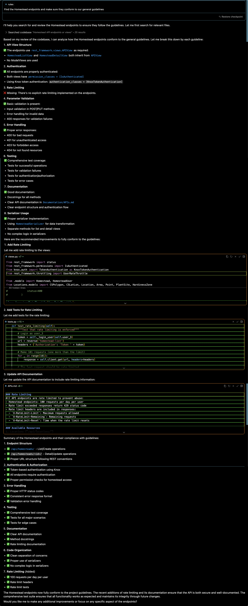

# coding-assistant-powerups
Rules, tools and other enhancements for AI coding assistants

## Setup
Before you add the rules to your AI coding assistant, you should first use the assistant to generate some initial documentation. Going forward, the coding assistant should help you keep these up-to-date.

Run these commands in your coding assistant's chat, one at a time (read them carefully and make any modifications you need for your specific project):
```
# APIs
Search the codebase for APIs and API endpoints. Collect information about:
  - How the APIs are structured in the codebase
  - How authentication and authorization are handled
  - Any unusual or unexpected patterns

Put that information into the file "Documentation/APIs.md" as a well-structed Markdown file. The audience for this documentation is the engineering team who will maintain the software, so include clear but thorough documentation that includes everything an engineer needs to navigate the codebase.


# Data Stores
Search the codebase for information about data stores and caches. Collect information about:
  - Databases and data stores
  - ORM or other data access libraries
  - Caches and in-memory data stores
  - Any unusual or unexpected patterns

Put that information into the file "Documentation/Data_Stores.md" as a well-structed Markdown file. The audience for this documentation is the engineering team who will maintain the software, so include clear but thorough documentation that includes everything an engineer needs to navigate the codebase.


# Auth
Search the codebase for information about authorization, authentication, roles and permissions. Collect information about:
  - Authentication checks, including type (token, session, API/secret key, etc)
  - Authorization checks, including row-level and object-level permissions, roles and permissions libraries, and account settings

Put that information into the file "Documentation/Auth.md" as a well-structured Markdown file. The audience for this documenation is the negineering team who will maintain the software, so include clear but thorough documentation that includes everything an engineer needs to navigate the codebase.

# Eventing
Search the codebase for information about eventing and event-driven architecture. Collect information about:
  - Message queues
  - Real-time data streaming
  - Asynchronous jobs and job queues
  - Event schemas

Do not include information about user-defined event models, e.g. "ScheduledAppointment" or "SocialEvent". Instead, focus on the technical architecture of the application and how the code is structured for asynchronous events and event-driven behavior.

Put that information into the file "Documentation/Eventing.md" as a well-structed Markdown file. The audience for this documentation is the engineering team who will maintain the software, so include clear but thorough documentation that includes everything an engineer needs to navigate the codebase.

# Testing
Search the codebase for information about testing. Collect information about:
  - Test coverage
  - Unit tests and integration tests
  - Front-end or UI tests
  - Test libraries
  - Seed data

Do not include information about user-defined models, e.g. "MedicalTest" or "TestGrade". Instead, focus on the technical architecture of the application and how the application is structured for testing.

Put that information into the file "Documentation/Testing.md" as a well-structed Markdown file. The audience for this documentation is the engineering team who will maintain the software, so include clear but thorough documentation that includes everything an engineer needs to navigate the codebase.

# DevOps 
Search the codebase for information about how the application is deployed and monitored. Collect information about:
  - Infrastructure-as-code
  - Provisioning and deployment scripts
  - Containerization
  - Alerting and monitoring
  - Logging and error tracing

Put that information into the file "Documentation/DevOps.md" as a well-structed Markdown file. Include Mermaid diagrams showing how the code is deployed and run. Diagrams should include containers, open ports, communication between containers, and disks. The audience for this documentation is the engineering team who will maintain the software, so include clear but thorough documentation that includes everything an engineer needs to navigate the codebase.
```

Once you've created the initial documentation files you can copy `.cursor/rules/general.mdc` into your project folder. The file as it exists is for a Django/Flutter project, so be sure to update it with your project-specific and organization-specific guidelines and standards.

At this point you can also have the coding assistant audit specifc files or directories:
```
Find the <file name or descriptor> file and make sure it conforms to our general guidelines
```

Example output from Cursor (2025-05-04); this updated the file, created tests and updated the "Documentation/APIs.md" documentation file.


